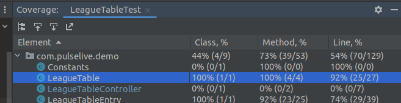

== Domain model

There are only 2 domain classes:
[plantuml]

----
class LeagueTableEntry
class Match
----

== Use cases

The instructions only specify one use case, which It would be:
As user,

----
I want to get the League table from a list of match results, So that I can see the classification of the League.
----

[plantuml]
----
left to right direction
user -> (GetLeagueTableEntry)
----

== Design

[plantuml]
----
class PulseLiveJavaActivityApplication implements CommandLineRunner
Class LeagueTableController
class MatchRepositoryDataHubSportFileSystemImpl implements MatchRepository
class MatchRepositoryDatabaseImpl implements MatchRepository

class SystemOutLeagueTablePresenterImpl implements LeagueTablePresenter
class FileSystemLeagueTablePresenterImpl implements LeagueTablePresenter

PulseLiveJavaActivityApplication ..> LeagueTableController
PulseLiveJavaActivityApplication ..> MatchRepositoryDataHubSportFileSystemImpl
PulseLiveJavaActivityApplication ..> SystemOutLeagueTablePresenterImpl

LeagueTableController --> MatchRepository
LeagueTableController --> LeagueTablePresenter
----

== Data source

I downloaded some data of football results from the following link:

https://datahub.io/sports-data/spanish-la-liga
https://datahub.io/sports-data/english-premier-league

== Unit tests

I created 5 unit tests that provide 92% of coverage for the main class (business logic) LeagueTable:

The tests check the following cases:

. Test to check when pass an empty List<Match>
. Test to check that all the values from the List<Match> are properly calculated into the LeagueTableEntry and the result List<LeagueTableEntry> is sorted by points
. Test to check that in case of equal points, then it sorts by goal difference
. Test to check that in case of equal points and goal difference, then it sorts by goal scored
. Test to check that in case of equal points and goal difference and goal scored, then it sorts them by team name
