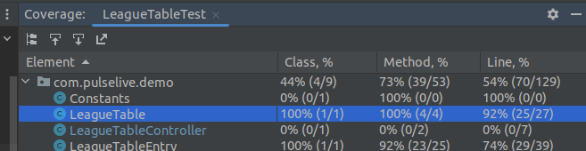
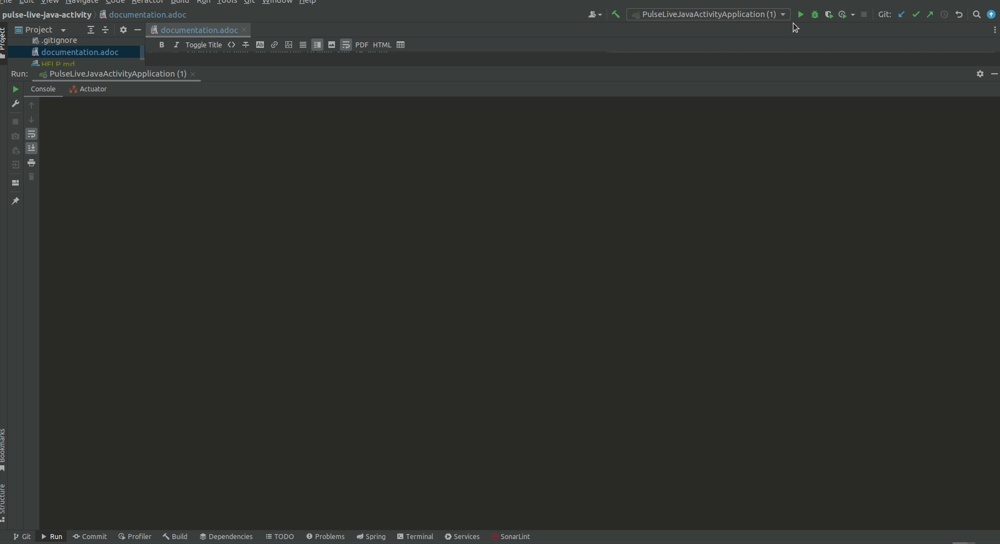

== Domain model

There are only 2 domain classes:
[plantuml,format=png]

----
class LeagueTableEntry
class Match
----

== Use cases

The instructions only specify one use case, which It would be:

----
As user,
I want to get the League table from a list of match results, So that I can see the classification of the League.
----

[plantuml,format=png]
----
left to right direction
user -> (GetLeagueTableEntry)
----

== Architecture
As the project is very small, I didn't split it in packages. But As it grows, I would propose a division by layers, as follow:

[plantuml,format=png]
----
package models
package controllers
package presenters
package repositories

controllers --> presenters
controllers --> repositories
controllers ..> models

presenters --> models
repositories --> models
----

== Design
The following design shows that the controller doesn't depend on the repository and Presenter implementations.

. the MatchRepositoryDataHubSportFileSystemImpl which take the list of match from a file place in the /data directory but we could switch to another implementation that for example, could take the match list from a database MatchRepositoryDatabaseImpl without change the implementation of the controller.
. The Same principle applies to LeagueTablePresenter. I have created an implementation that present the LeagueTable by console (LeagueTableSystemOutPresenterImpl), but we could create another one to, for example, create a file with the results (FileSystemLeagueTablePresenterImpl) or maybe to build a json to be returned with an api rest.

[plantuml, target=diagram-classes, format=png]
----
class PulseLiveJavaActivityApplication implements CommandLineRunner
Class LeagueTableController
class MatchRepositoryDataHubSportFileSystemImpl implements MatchRepository
class MatchRepositoryDatabaseImpl implements MatchRepository

class LeagueTableSystemOutPresenterImpl implements LeagueTablePresenter
class FileSystemLeagueTablePresenterImpl implements LeagueTablePresenter

PulseLiveJavaActivityApplication ..> LeagueTableController
PulseLiveJavaActivityApplication ..> MatchRepositoryDataHubSportFileSystemImpl
PulseLiveJavaActivityApplication ..> LeagueTableSystemOutPresenterImpl

LeagueTableController --> MatchRepository
LeagueTableController --> LeagueTablePresenter
----

== Data source

I downloaded some data of football results from the following link:

https://datahub.io/sports-data/spanish-la-liga

https://datahub.io/sports-data/english-premier-league

== Unit tests

I created 5 unit tests that provide 92% of coverage for the main class (business logic) LeagueTable:

The tests check the following cases:

. Test to check when pass an empty List<Match>
. Test to check that all the values from the List<Match> are properly calculated into the LeagueTableEntry and the result List<LeagueTableEntry> is sorted by points
. Test to check that in case of equal points, then it sorts by goal difference
. Test to check that in case of equal points and goal difference, then it sorts by goal scored
. Test to check that in case of equal points and goal difference and goal scored, then it sorts them by team name

== Running the App
Just Run the Spring main class.
The data source files are placed in the /data folder, and there are files with data of the spanish league and premier league for 10 years.
The application will show the results in the console.

An execution with the results of the console link:documentationfiles/ExecutionResultConsole.txt[can be opened here].

